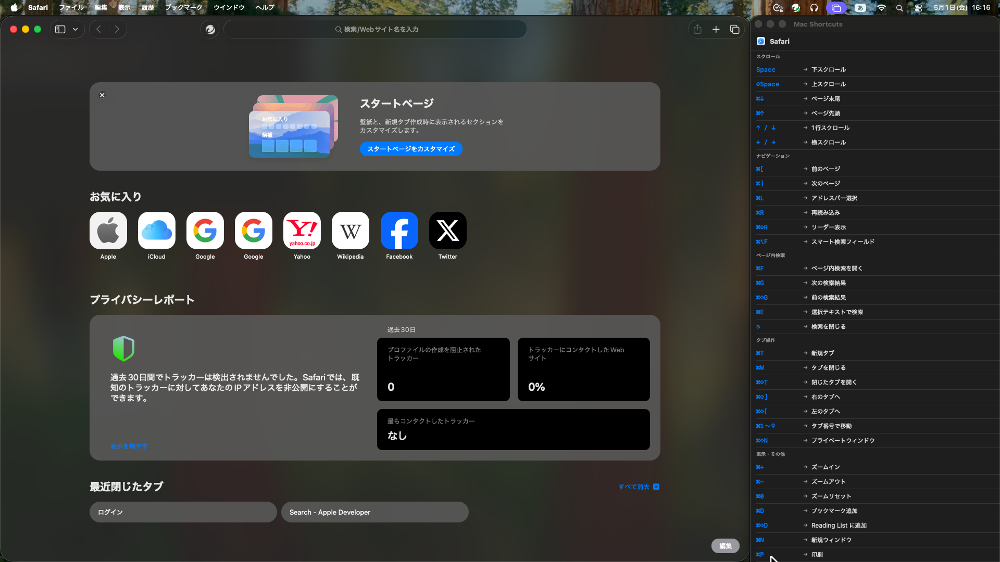
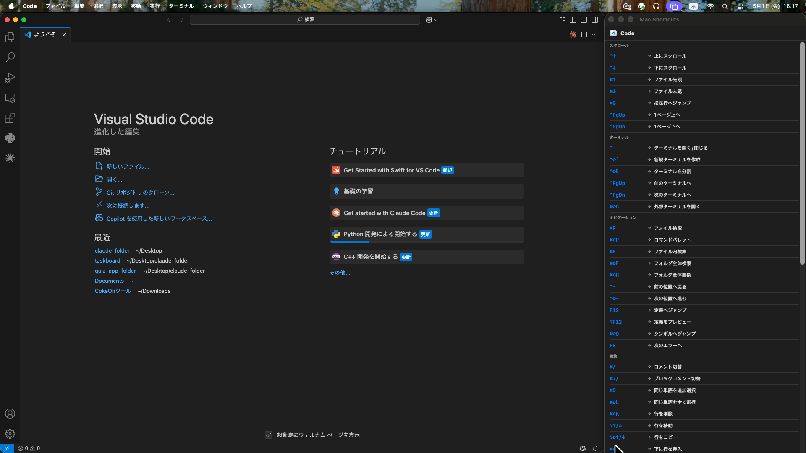

# Mac Shortcuts

アクティブなアプリを自動検出し、そのアプリのキーボードショートカットを画面右端に表示する macOS アプリです。  
同時にウィンドウを自動整列し、作業スペースを効率的に活用できます。

---

## 動作イメージ

### Safari を使用中


### VS Code を使用中


---

## 機能

### ウィンドウ自動整列
- アプリを切り替えると、対象アプリのウィンドウが**画面左 3/4** に自動配置されます
- Mac Shortcuts 自身は**画面右 1/4** に固定表示されます

### ショートカット自動表示
- アクティブなアプリを検出し、対応するショートカット一覧を即座に表示します
- カテゴリ別（スクロール・タブ操作・編集など）に整理して表示します

### 対応アプリ
| アプリ | 対応 |
|---|---|
| Safari | ✅ |
| Google Chrome | ✅ |
| Firefox | ✅ |
| Terminal | ✅ |
| Visual Studio Code | ✅ |
| Finder | ✅ |
| Slack | ✅ |
| Xcode | ✅ |
| その他のアプリ | ✅（汎用ショートカットを表示） |

---

## セットアップ

### 必要環境
- macOS 13 以上
- Swift 5.9 以上（`swift --version` で確認）

### インストール・起動

```bash
git clone https://github.com/sasuketaro/mac-shortcuts.git
cd mac-shortcuts
swift run
```

### 初回セットアップ（アクセシビリティ権限）

他アプリのウィンドウを操作するために、アクセシビリティ権限が必要です。

1. `swift run` を実行すると権限ダイアログが表示されるので「開く」をクリック
2. **システム設定 → プライバシーとセキュリティ → アクセシビリティ** を開く
3. `MacShortcuts` をオンにする
4. アプリを再起動する

---

## 技術スタック

| 項目 | 内容 |
|---|---|
| 言語 | Swift |
| UI | SwiftUI + AppKit |
| ビルド | Swift Package Manager |
| ウィンドウ操作 | ApplicationServices（AXUIElement API） |
| 状態管理 | Combine（ObservableObject / @Published） |

---

## ディレクトリ構成

```
mac-shortcuts/
├── Package.swift
├── Sources/
│   └── MacShortcuts/
│       ├── main.swift               # エントリポイント
│       ├── AppDelegate.swift        # アプリライフサイクル・監視
│       ├── AppState.swift           # 共有状態管理
│       ├── Models.swift             # データモデル
│       ├── ContentView.swift        # UI
│       ├── WindowManager.swift      # ウィンドウ配置ロジック
│       └── ShortcutsDatabase.swift  # ショートカットデータベース
└── docs/
    └── imports.md                   # 使用フレームワーク解説
```
